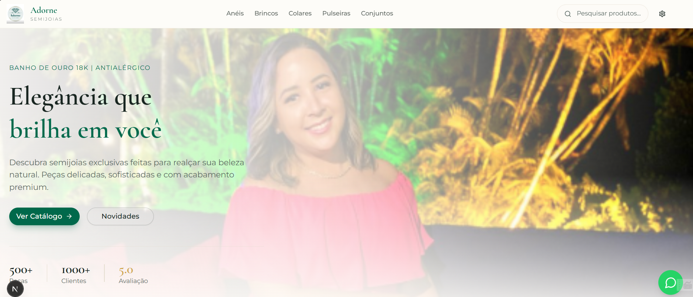

# 💎 Online Semijoias Catalog

Sistema completo de catálogo online para semijoias com painel administrativo. Aplicação full-stack desenvolvida com arquitetura moderna, totalmente dockerizada e pronta para produção.

## 📖 Sobre o Projeto

Este é um **projeto pessoal** desenvolvido para resolver uma necessidade real: criar um catálogo online onde clientes possam visualizar, explorar e comprar semijoias de forma intuitiva e moderna.

### O Problema

A necessidade surgiu da dificuldade de apresentar um catálogo de semijoias de forma organizada e profissional online. Era necessário uma solução que permitisse:

- Exibir produtos de forma elegante e organizada por categorias
- Facilitar o contato e compra através de integração com WhatsApp
- Gerenciar produtos, categorias e imagens de forma simples através de um      painel administrativo
- Oferecer uma experiência responsiva e moderna em todos os dispositivos

### A Solução

Desenvolvemos uma aplicação full-stack completa que resolve todas essas necessidades, utilizando tecnologias modernas e boas práticas de desenvolvimento.

## 🛠️ Tecnologias Utilizadas

### Frontend
- **Next.js 16** - Framework React com App Router para performance otimizada
- **React 19** - Biblioteca para construção de interfaces
- **TypeScript** - Tipagem estática para maior segurança e produtividade
- **Tailwind CSS** - Framework CSS utility-first para estilização rápida
- **shadcn/ui** - Componentes UI acessíveis e customizáveis
- **React Hook Form + Zod** - Gerenciamento e validação de formulários

### Backend
- **Node.js** - Runtime JavaScript
- **Express.js** - Framework web minimalista e flexível
- **TypeScript** - Tipagem estática no backend
- **PostgreSQL** - Banco de dados relacional robusto
- **JWT** - Autenticação segura via tokens
- **Multer** - Upload de arquivos e imagens

### Infraestrutura
- **Docker** - Containerização para ambiente isolado
- **Docker Compose** - Orquestração de múltiplos containers
- **PostgreSQL 16** - Banco de dados em container

## ✨ O Que Foi Desenvolvido

### Área Pública
- ✅ Página inicial com hero section, categorias e seções de produtos
- ✅ Navegação por categorias (Anéis, Brincos, Colares, Pulseiras, Conjuntos)
- ✅ Páginas de produto com galeria de imagens e detalhes completos
- ✅ Integração com WhatsApp para contato direto
- ✅ Design responsivo para mobile, tablet e desktop
- ✅ Sistema de temas (claro/escuro)
- ✅ Busca de produtos
- ✅ Páginas institucionais (Sobre, FAQ, Políticas)

### Área Administrativa
- ✅ Sistema de autenticação com JWT
- ✅ Painel administrativo para gerenciamento
- ✅ CRUD de produtos
- ✅ Gerenciamento de categorias
- ✅ Upload e gerenciamento de imagens
- ✅ Interface intuitiva e moderna

### Infraestrutura
- ✅ Ambiente totalmente dockerizado
- ✅ Configuração com Docker Compose
- ✅ Banco de dados PostgreSQL configurado
- ✅ API REST estruturada
- ✅ Segurança implementada (Helmet, Rate Limiting, CORS)

## 🚀 Como Executar

### Pré-requisitos
- Docker 20.10+ e Docker Compose 2.0+ instalados

### Passos para Execução

1. **Clone o repositório**
```bash
git clone <url-do-repositorio>
cd online-semijoias-catalog
```

2. **Configure as variáveis de ambiente**
```bash
cp env.example .env
```

Edite o arquivo `.env` com suas configurações (consulte o `env.example` para referência).

3. **Inicie os containers**
```bash
docker-compose up --build
```

4. **Acesse a aplicação**
- Frontend: http://localhost:3000
- Backend API: http://localhost:3001
- Health Check: http://localhost:3001/health

### Comandos Úteis

```bash
# Iniciar em background
docker-compose up -d --build

# Ver logs
docker-compose logs -f

# Parar containers
docker-compose down

# Parar e remover volumes
docker-compose down -v
```

## ⚙️ Configuração

O projeto utiliza variáveis de ambiente para configuração. Consulte o arquivo `env.example` para ver todas as variáveis disponíveis e configure conforme seu ambiente.

**Importante:** Não commite o arquivo `.env` com informações sensíveis. Use o `env.example` como referência.

## 📊 Status do Projeto

### ✅ Implementado
- Frontend completo com Next.js 16
- Backend API com Express.js e TypeScript
- Banco de dados PostgreSQL configurado
- Sistema de autenticação JWT
- Painel administrativo funcional
- Upload de imagens
- Integração WhatsApp
- Design responsivo
- Sistema de temas
- Ambiente dockerizado

### 🚧 Em Desenvolvimento
- Finalização completa das rotas da API
- Implementação de todas as funcionalidades do CRUD
- Sistema de busca avançada
- Filtros de produtos
- Melhorias de performance
- Testes automatizados

## 🎯 Próximos Passos

Este projeto está em **processo de desenvolvimento ativo**. As próximas implementações incluem:

- Finalização das rotas da API
- Melhorias no painel administrativo
- Sistema de busca e filtros avançados
- Otimizações de performance
- Implementação de testes
- Melhorias de SEO
- PWA (Progressive Web App)

## 📝 Observações

Este é um projeto pessoal desenvolvido para aprendizado e uso real. A arquitetura foi pensada para escalabilidade e manutenibilidade, seguindo as melhores práticas de desenvolvimento moderno.

---



**Desenvolvido com ❤️ usando Next.js, TypeScript, Node.js e PostgreSQL**
